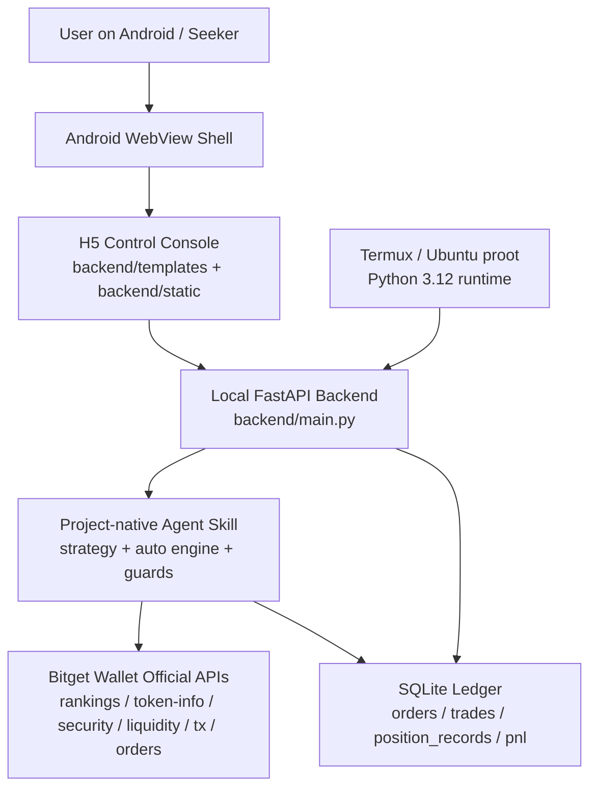
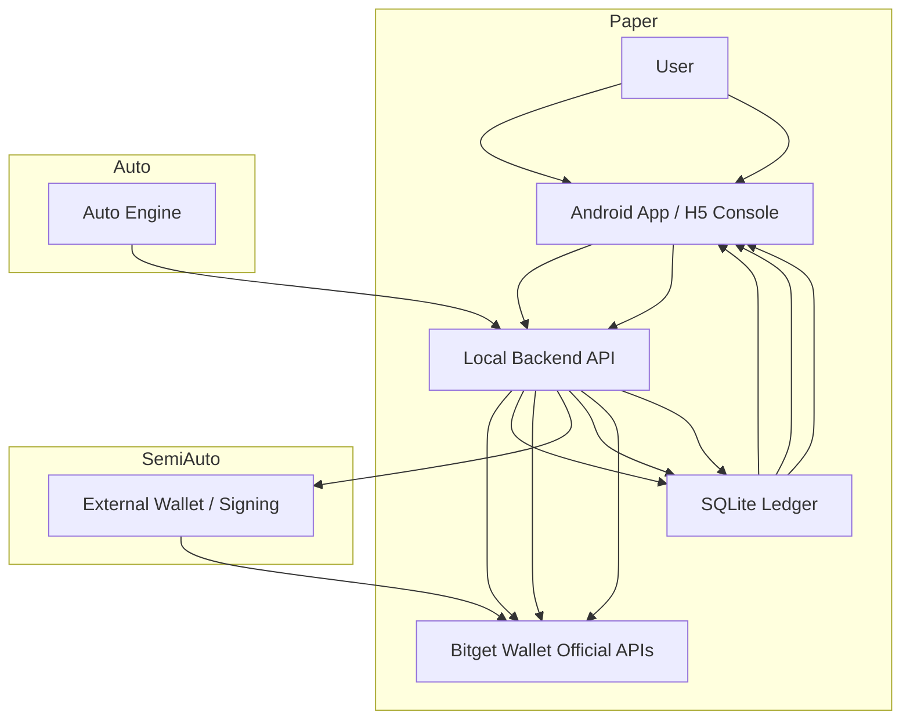

# HabitMeme Mobile

Final submission implementation for the Android-local auto trading agent.

## Structure

- `backend/`: FastAPI local backend for Termux
- `web/`: folded into `backend/templates` and `backend/static`
- `android-shell/`: Kotlin WebView wrapper
- `docs/`: Android, Termux, demo, and submission docs
- `skills/`: project skills, including the current project-wide strategy skill
- `tests/`: smoke and unit-oriented checks

## Strategy Skill

For the current project-wide trading strategy and runtime semantics, see:

- [`skills/habitmeme-mobile-strategy/SKILL.md`](skills/habitmeme-mobile-strategy/SKILL.md)

This skill documents the implemented behavior for:

- `paper / semi-auto / auto`
- candidate discovery and filtering
- exits, guards, and cooldowns
- position/PnL semantics
- Android-local runtime boundaries

## Architecture



Runtime shape:

- frontend runs as an Android WebView shell
- backend runs locally in Termux / Ubuntu proot
- strategy and auto logic run inside the local backend
- official Bitget Wallet APIs provide market and order primitives
- SQLite is the local source of truth for orders, positions, and PnL

## Trading Mode Flows



Mode summary:

- `paper`: uses real discovery and quote data, but fills are simulated locally
- `semi-auto`: backend prepares orders and the user confirms/signs externally
- `auto`: the local auto engine handles discovery, filtering, entry, monitoring, and exits automatically while the backend runtime stays alive

## Local Run

```bash
cd habitmeme-mobile
cp .env.example .env
uv run uvicorn backend.main:app --host 127.0.0.1 --port 8787
```

If you are running inside Android Termux and hit the native Python 3.13 / `pydantic-core` build issue, use the Ubuntu `proot-distro` workaround documented in [`docs/TERMUX_SETUP.md`](docs/TERMUX_SETUP.md). The working startup command there becomes:

```bash
cd /path/to/habitmeme-mobile
. .venv312/bin/activate
python -V
uv sync --python .venv312/bin/python
python -m uvicorn backend.main:app --host 127.0.0.1 --port 8787
```

On Android, you can reduce the chance of Termux being suspended during a longer run by enabling:

```bash
termux-wake-lock
```

Use it before starting the backend. This helps keep the device awake, but it does **not** guarantee OS-level background persistence.

## Notes

- The original `bitget-wallet-skill` directory is intentionally preserved as-is.
- The new implementation lives only inside this directory.
- For local verification in this environment, prefer `uv run python -m ...` so Python 3.11 is used.

## FAQ

### Does this project only use the official Bitget Wallet Skill?

No.

The official Bitget Wallet capability surface is the foundation, but this project adds its own project-native Agent skill on top:

- two-stage candidate filtering
- `riskMode`-based strategy profiles
- up to 2 concurrent positions
- reserve-aware budget allocation
- staged exits
- stale-order recovery
- position history and PnL tracking
- mobile-local runtime behavior

See [`skills/habitmeme-mobile-strategy/SKILL.md`](skills/habitmeme-mobile-strategy/SKILL.md).

### What if native Termux Python is 3.13 and dependency install fails?

Recent Termux often ships native `python3.13`, and this project can fail there because `pydantic-core` may not install cleanly in that environment.

Recommended workaround:

- use `proot-distro`
- use Ubuntu inside proot
- create `.venv312`
- run the backend from Python `3.12`

See [`docs/TERMUX_SETUP.md`](docs/TERMUX_SETUP.md).

### Does `termux-wake-lock` solve Android background kill behavior?

It helps reduce sleep-related interruption, but it does **not** guarantee OS-level background persistence.

Use:

```bash
termux-wake-lock
```

before starting the backend, but do not describe the current runtime as a guaranteed always-on Android daemon.

### Does `Stop Auto` automatically sell existing positions?

No.

`Stop Auto` stops the auto runtime. It does not force-sell open positions. Existing open positions remain in the ledger and can still be sold manually or managed after auto resumes.

### After the App is reopened, if Auto still shows as running, is it really active?

Only if the backend-side auto thread is actually alive.

The current code no longer trusts the database flag alone. If the database says `running=1` but the runtime thread is gone, the backend will correct the state to `runtime_stopped`.

So:

- if the App restarts but backend + auto thread are still alive, auto is still active
- if only the database row remained, auto is not actually active

### In conservative mode, how many slots are used?

Current behavior:

- `conservative`: 1 slot
- `normal`: 2 slots
- `degen`: 2 slots

This is the current implemented behavior, not just a UI label.

### What does `reserveSolBalance` mean?

Right now, it is **not** a true wallet-level minimum SOL balance check.

Its current meaning is closer to:

- the portion of the configured auto budget that should remain unused for new entries

So if:

- `budgetSol = 0.05`
- `reserveSolBalance = 0.02`

then the deployable budget is effectively about `0.03`.

### How long does the loss guard block auto buying?

The current loss guard is **condition-based, not time-based**.

- `daily_loss_limit_guard` blocks new buys while the latest same-day realized PnL is still below the configured threshold
- `max_consecutive_losses_guard` blocks new buys while the recent losing streak condition is still true

This means it is not “blocked for 30 minutes” or another fixed cooldown. It remains blocked until the underlying condition is cleared or history is reset.

### If Auto wants to buy but slots are full, what happens?

It waits.

Current behavior is:

- auto keeps running
- existing positions continue to be managed
- no new buy is opened until a slot becomes available

### Why can `Find Candidates` still return results when rate limits happen, while Auto may slow down or enter cooldown?

Because they use different runtime semantics.

- `Find Candidates` is a one-shot request and can still return partial usable results after retries
- `Auto` is a continuous runtime and is more conservative about repeated upstream rate limits

Current auto mitigations include:

- reduced discovery fan-out
- short TTL caches for token-analysis endpoints
- quote throttling
- cooldown / breaker handling

### What do the Advanced Strategy settings mean?

These fields are the base strategy parameters. The final active values may still be adjusted by `riskMode` in the running strategy profile.

#### `Min Liquidity USD`

- Minimum liquidity threshold for a candidate
- Tokens below this liquidity threshold are blocked from entry
- Mainly affects `Discover` and `Auto` candidate filtering

#### `Stop Loss Pct`

- Hard stop-loss threshold relative to entry price
- Example: `0.12` means roughly a `12%` loss threshold
- Mainly affects automatic exits in `auto`

#### `Recover Cost Basis Pct`

- First staged take-profit threshold
- When reached, the strategy tries to sell enough to recover the original cost basis

#### `Half Take Profit Pct`

- Second staged take-profit threshold
- When reached, the strategy sells about half the remaining position

#### `Moonbag Trigger Pct`

- Higher take-profit threshold for leaving only a small moonbag

#### `Moonbag Fraction`

- Fraction of the position to keep after the moonbag stage
- Example: `0.10` means keep about `10%`

#### `Max Hold Hours`

- Maximum time to keep a position before time-exit logic becomes eligible

#### `Time Exit Max Gain Pct`

- Used together with `Max Hold Hours`
- If a position has been held too long and has not achieved enough gain, time-exit logic can close it

#### `Discover Interval Sec`

- How often auto runs a new discovery cycle
- Lower values increase request frequency and can increase rate-limit pressure

#### `Order Poll Interval Sec`

- How often order status is polled after submission
- Lower values make updates faster but increase request frequency

#### `Order Poll Max`

- Maximum number of order-status polls in one tracking sequence

#### `Auto Daily Loss Limit SOL`

- Portfolio-level buy guard for the current day
- When same-day realized PnL drops below this threshold, auto blocks new buys
- This guard is currently condition-based, not a fixed timer cooldown

#### `Auto Max Consecutive Losses`

- Buy guard based on the recent losing streak
- When the recent consecutive-loss count reaches this threshold, auto blocks new buys
- This is also condition-based, not time-based

#### `Reserve SOL Balance`

- Current meaning: budget reserved from the configured auto budget
- It is **not** a true wallet-level minimum SOL balance check
- Example:
  - `budgetSol = 0.05`
  - `reserveSolBalance = 0.02`
  - deployable budget is effectively about `0.03`

### Which Advanced Strategy settings matter outside `auto`?

Most advanced strategy fields primarily affect `auto`.

The main fields that also influence other flows are:

- `defaultBudgetSol`
- `budgetSolMax`
- `riskMode` default selection
- `Order Poll Interval Sec`
- `Order Poll Max`

By contrast, staged exit parameters such as stop loss, cost-basis recovery, half take-profit, moonbag, and time-exit are mainly meaningful in `auto`.
